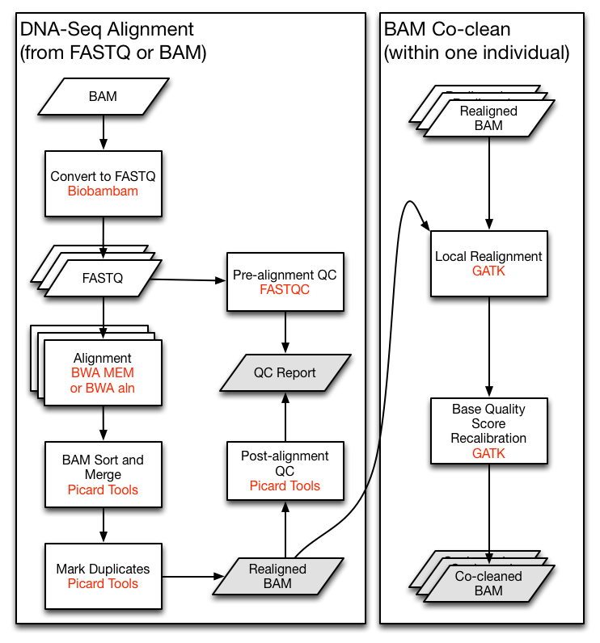

# GDC SNP data analysis using deep learning

## Table of Contents

- [Data Preparation](#data-preparation)
   - [Feature generation](#feature-generation)
   - [Feature evaluation](#feature-evaluation)
      - [PCA and Covariates](#pca-and-covariates)
- [Somatic Variant Calling Workflow](#somatic-variant-calling-workflow)
- [Simulation](#simulation)
     - [Trial 1 with Mutect Data](#trial-1-with-mutect-data)

## Data Preparation

33 cancer types processed by 4 somatic calling tools: [MuSE (MS)](http://www.biorxiv.org/content/early/2016/05/25/055467.abstract), [MuTect2 (MK)](https://www.nature.com/articles/nbt.2514), [VarScan2 (VS)](https://genome.cshlp.org/content/22/3/568.short), and [SomaticSniper (SS)](http://bioinformatics.oxfordjournals.org/content/28/3/311.short)

### Feature generation

TBD

### Feature evaluation

TBD

#### PCA and Covariates

TBD

## Somatic Variant Calling Workflow

Aligned tumor-normal BAM pairs are processed through the Somatic Mutation Calling Workflow.

*DNA-seq alignment pipeline-Courtesy of GDC*

*Mutect somatic variant calling pipeline-Courtesy of GDC*

## Simulation

### Trial 1 with Mutect Data

Dataset: Somatic mutation data from MuTeck2 (MT) in total of 8132 samples

| Label | Cancer Type  | # of features (MT) | # of Samples (MT)|
| ------|------------- | -------------------|------------------|
|   1 	|    ACC 	     |          4752	    |        92        |
|   2	  |    BLCA 	   |          16551	    |       412        |
|   3		|    BRCA      |          16131	    |       985        |
|   4		|    CESC 	   |          15342	    |       289        |
|   5		|    CHOL      |          2333 	    |        50        |
|   6		|    COAD 	   |          18037	    |       399        |
|   7		|    DLBC 	   |          2976 	    |        37        |
|   8		|    ESCA 	   |          10719	    |       184        |
|   9		|    GBM 	     |          14778	    |       392        |
|  10		|    HNSC 	   |          15436	    |       508        |
|  11		|    KICH 	   |          1634 	    |        66        |
|  12		|    KIRC 	   |          9444 	    |       336        |
|  13		|    KIRP 	   |          8689 	    |       281        |
|  14		|    LAML 	   |          4810 	    |       140        |
|  15		|    LGG 	     |          10728 	  |       507        |
|  16		|    LIHC 	   |          12704 	  |       363        |
|  17		|    LUAD 	   |          16980 	  |       565        |
|  18		|    LUSC 	   |          16784 	  |       491        |
|  19		|    MESO 	   |          2027 	    |        81        |
|  20		|    OV 	     |          14226 	  |       436        |
|  21		|    PAAD 	   |          9967  	  |       175        |
|  22		|    PCPG 	   |          1416  	  |       178        |
|  23		|    PRAD 	   |          9829  	  |       494        |
|  24		|    READ 	   |          13333 	  |       137        |
|  25		|    SARC 	   |          8119  	  |       237        |
|  26		|    SKCM 	   |          17509 	  |       467        |
|  27		|    STAD 	   |          17431	    |       437        |
|  28		|    TGCT 	   |          1749 	    |       144        |
|  29		|    THCA 	   |          4643 	    |       490        |
|  30		|    THYM 	   |          2084 	    |       123        |
|  31		|    UCEC 	   |          18998	    |       530        |
|  32		|    UCS 	     |          5110  	  |        57        |
|  33		|    UVM   	   |          1082  	  |        80        |

**Summary of DNN**

- Input data: training (8132 samples x 19384 features) and test (2031 samples x 19384 features)
- class labels: 33
- primarily results

  
*Figure 1. accuracy (A) and loss (B) scores are shown over epochs. The training accuracy continues to improve whereas the test accuracy
stabilizes around 20 epochs that is explanined by the loss score where the validation loss does not decrease at around 20 epochs.*
