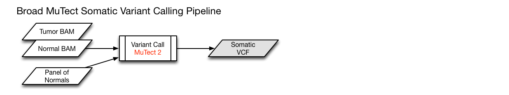

# GDC SNP data analysis using deep learning

## Table of Contents

- [Data Preparation](#data-preparation)
   - [Feature generation](#feature-generation)
- [Simulation A](#simulation-a)
  - [All mutation data](#all-mutation-data)
  - [All mutation data normalized by gene length](#all-mutation-data-normalized-by-gene-length)
- [Simulation B](#simulation-b)
  - [Nonsynonymous mutation data](#nonsynonymous-mutation-data)
  - [Nonsynonymous mutation data normalized by gene length](#nonsynonymous-mutation-data-normalized-by-gene-length)


- [Supplementary Information](#supplementary-information)
     - [List of mutations](#list-of-mutations)
     - [Somatic Variant Calling Workflow](#somatic-variant-calling-workflow)

## Data Preparation

Masked somatic mutation data for 33 cancer types are available which are processed by 4 somatic calling tools: [MuSE (MS)](http://www.biorxiv.org/content/early/2016/05/25/055467.abstract), [MuTect2 (MT)](https://www.nature.com/articles/nbt.2514), [VarScan2 (VS)](https://genome.cshlp.org/content/22/3/568.short), and [SomaticSniper (SS)](http://bioinformatics.oxfordjournals.org/content/28/3/311.short). The data is from whole genome sequencing (WGS).  


For the performance evaluation, we select 21 cancer types that include both reasonable number of features
samples. For the full list of cancer, please click [here](#gdc-cancer).

**Evaluation with cancer data with samples >100 and the median number of variants > 15**

| Label | Cancer Type  | # of features (MT) | # of Samples (MT)|
| ------|------------- | -------------------|------------------|
|   1	  |    BLCA 	   |          16551	    |       412        |
|   2		|    BRCA      |          16131	    |       985        |
|   3		|    CESC 	   |          15342	    |       289        |
|   4		|    COAD 	   |          18037	    |       399        |
|   5		|    ESCA 	   |          10719	    |       184        |
|   6		|    GBM 	     |          14778	    |       392        |
|   7		|    HNSC 	   |          15436	    |       508        |
|   8		|    KIRC 	   |          9444 	    |       336        |
|   9		|    KIRP 	   |          8689 	    |       281        |
|  10		|    LGG 	     |          10728 	  |       507        |
|  11		|    LIHC 	   |          12704 	  |       363        |
|  12		|    LUAD 	   |          16980 	  |       565        |
|  13		|    LUSC 	   |          16784 	  |       491        |
|  14		|    OV 	     |          14226 	  |       436        |
|  15		|    PAAD 	   |          9967  	  |       175        |
|  16		|    PRAD 	   |          9829  	  |       494        |
|  17		|    READ 	   |          13333 	  |       137        |
|  18		|    SARC 	   |          8119  	  |       237        |
|  19		|    SKCM 	   |          17509 	  |       467        |
|  20		|    STAD 	   |          17431	    |       437        |
|  21		|    UCEC 	   |          18998	    |       530        |

### Feature generation

Generate a count matrix of mutation that is based on the number of mutation per gene per sample.

- First, we include all mutations (i.e.,  [sysnonymous](https://en.wikipedia.org/wiki/Synonymous_substitution) and [non-sysnonymous](https://en.wikipedia.org/wiki/Nonsynonymous_substitution)) except the variants in noncoding regions.

Note that sysnonymous mutation does not change encoded amino acid whereas non-sysnonymous mutation does.

- Second, we include only non-sysnonymous ( or missense) mutation.

For more details about mutations, please see [List of mutations](#list-of-mutations).

- Third, we include pathway features utilizing the [GSEA MSigDB](http://software.broadinstitute.org/gsea/msigdb/collections.jsp).


## Simulation A

* Input data: training ( 6470 samples x 19372 features) and test ( 2155 samples x 19372 features)
* class labels: 21

* Common hyperparameters
```
conv=[128, 20, 1, 128, 10, 1]
dense=[256, 128]
activation='relu'
out_act='softmax'
loss='categorical_crossentropy'
optimizer='adam'
metrics='accuracy'
epochs=20
batch_size=32
classes=21
```

### 1. All-mutation data


* Figure 1. accuracy (A) and loss (B) scores are shown over epochs with dropout=0.1 and max pooling 1 x 10. The best test accuracy is 42.5%.


* Figure 2. accuracy (A) and loss (B) scores are shown over epochs with dropout=0.3 and max pooling 1 x 10. The best test accuracy is 40.4%.

  
* Figure 3. accuracy (A) and loss (B) scores are shown over epochs with dropout=0.5 and max pooling 1 x 10. The best test accuracy is 40.6%.


* Figure 4. accuracy (A) and loss (B) scores are shown over epochs with dropout=0.1 and *no* max pooling. The best test accuracy is 44.9%.


### 2. All mutation data normalized by gene length


* Figure 6. accuracy (A) and loss (B) scores are shown over epochs with dropout=0.1 and max pooling 1 x 10. The best test accuracy is 38.4%.


* Figure 7. accuracy (A) and loss (B) scores are shown over epochs with dropout=0.3 and max pooling 1 x 10. The best test accuracy is 40.2%.


* Figure 8. accuracy (A) and loss (B) scores are shown over epochs with dropout=0.5 and max pooling 1 x 10. The best test accuracy is 40.9%.


* Figure 9. accuracy (A) and loss (B) scores are shown over epochs with dropout=0.1 and *no* max pooling. The best test accuracy is 45.5%.


* Figure 10. accuracy (A) and loss (B) scores are shown over epochs with dropout=0.5 and *no* max pooling. The best test accuracy is 48.2%.

- A few notes by observing the performance:
  - due to the overfitting problems shown in loss figures, dropout of 0.5 seems to be the right choice.
  - Due to the nature of sparsity in variant data, a downsampling strategy may not work well.  In fact, the best test accuracies were observed without max pooling.    

## [ ] Simulation B

* Input data: training ( 6470 samples x 19372 features) and test ( 2155 samples x 19372 features)
* class labels: 21

* Common hyperparameters
```
conv=[128, 20, 1, 128, 10, 1]
dense=[256, 128]
activation='relu'
out_act='softmax'
loss='categorical_crossentropy'
optimizer='adam'
metrics='accuracy'
epochs=20
batch_size=32
classes=21
```

### 3. Nonsynonymous mutation data

* Input data: training (8132 samples x 19384 features) and test (2031 samples x 19384 features)
* class labels: 21

  
* Figure 1. accuracy (A) and loss (B) scores are shown over epochs with dropout=0.1. The training accuracy continues to improve whereas the test accuracy
stabilizes around 20 epochs that is explanined by the loss score where the validation loss does not decrease at around 20 epochs.*

  
* Figure 2. accuracy (A) and loss (B) scores are shown over epochs with dropout=0.2. With the change of dropout to 0.2, slight improvements have been observed, but not the overfitting problem.*

### 4. Nonsynonymous mutation data normalized by gene length

- Input data
  - snp count (8625 x 19371)
  - <del>c1 (positional gene sets) pathway (8623 x 326)</del>
  - c2 (Curated gene sets) pathway (8623 x 4762)
  - <del>c3 (noncoding) pathway (8616 x 836)</del>
  - c4 (cancer-oriented computational gene sets) pathway (8610 x 858)
  - c5 (GO gene sets) pathway (8622 x 5917)
  - c6 (oncogenic signatures) pathway (8613 x 189)
  - c7 (immunologic signatures) pathway (8623 x 4872)
  - <del>h (hallmark gene sets) pathway (8576 x 50)</del>


----------

## Supplementary Information

### List of mutations

The variant classifications from TCGA MAF.

- Intron -- variant lies between exons within the bounds of the chosen transcript.
- 5'UTR -- variant is on the 5'UTR for the chosen transcript
- 3'UTR -- variant is on the 3'UTR for the chosen transcript
- IGR -- intergenic region. Does not overlap any transcript.
- 5'Flank -- the variant is upstream of the chosen transcript (within 3kb)
- [Missense_Mutation](https://en.wikipedia.org/wiki/Missense_mutation) -- the point mutation alters the protein structure by one amino acid.
- [Nonsense_Mutation](https://en.wikipedia.org/wiki/Nonsense_mutation) -- a premature stop codon is created by the variant.
- Nonstop_Mutation -- variant removes stop codon.
- Silent -- variant is in coding region of the chosen transcript, but protein structure is identical. I.e. a synonymous mutation
- Splice_Site -- the variant is within two bases of a splice site. See the secondary classification to determine if it lies on the exon or intron side.
- In_Frame_Del -- deletion that keeps the sequence in frame.
- In_Frame_Ins -- insertion that keeps the sequence in frame.
- [Frame_Shift_Ins](https://en.wikipedia.org/wiki/Frameshift_mutation) -- insertion that moves the coding sequence out of frame.
- [Frame_Shift_Del](https://en.wikipedia.org/wiki/Frameshift_mutation) -- deletion that moves the coding sequence out of frame.
- Start_Codon_SNP -- point mutation that overlaps the start codon.
- Start_Codon_Ins -- insertion that overlaps the start codon.
- Start_Codon_Del -- deletion that overlaps the start codon.
- De_novo_Start_InFrame -- New start codon is created by the given variant using the chosen transcript. However, it is in frame relative to the coded protein.
- De_novo_Start_OutOfFrame -- New start codon is created by the given variant using the chosen transcript. However, it is out of frame relative to the coded protein.
- RNA -- variant lies on one of the RNA transcripts.
- lincRNA -- variant lies on one of the lincRNAs.

### Somatic Variant Calling Workflow

Aligned tumor-normal BAM pairs are processed through the Somatic Mutation Calling Workflow.


*DNA-seq alignment pipeline-Courtesy of GDC*



*Mutect somatic variant calling pipeline-Courtesy of GDC*

### GDC Cancer
Below is the summary of GDC somatic varinants data processed by MuTect2, in total of 8132 samples.

| Label | Cancer Type  | # of features      | # of Samples     |
| ------|------------- | -------------------|------------------|
|   1 	|    ACC 	     |          4752	    |        92        |
|   2	  |    BLCA 	   |          16551	    |       412        |
|   3		|    BRCA      |          16131	    |       985        |
|   4		|    CESC 	   |          15342	    |       289        |
|   5		|    CHOL      |          2333 	    |        50        |
|   6		|    COAD 	   |          18037	    |       399        |
|   7		|    DLBC 	   |          2976 	    |        37        |
|   8		|    ESCA 	   |          10719	    |       184        |
|   9		|    GBM 	     |          14778	    |       392        |
|  10		|    HNSC 	   |          15436	    |       508        |
|  11		|    KICH 	   |          1634 	    |        66        |
|  12		|    KIRC 	   |          9444 	    |       336        |
|  13		|    KIRP 	   |          8689 	    |       281        |
|  14		|    LAML 	   |          4810 	    |       140        |
|  15		|    LGG 	     |          10728 	  |       507        |
|  16		|    LIHC 	   |          12704 	  |       363        |
|  17		|    LUAD 	   |          16980 	  |       565        |
|  18		|    LUSC 	   |          16784 	  |       491        |
|  19		|    MESO 	   |          2027 	    |        81        |
|  20		|    OV 	     |          14226 	  |       436        |
|  21		|    PAAD 	   |          9967  	  |       175        |
|  22		|    PCPG 	   |          1416  	  |       178        |
|  23		|    PRAD 	   |          9829  	  |       494        |
|  24		|    READ 	   |          13333 	  |       137        |
|  25		|    SARC 	   |          8119  	  |       237        |
|  26		|    SKCM 	   |          17509 	  |       467        |
|  27		|    STAD 	   |          17431	    |       437        |
|  28		|    TGCT 	   |          1749 	    |       144        |
|  29		|    THCA 	   |          4643 	    |       490        |
|  30		|    THYM 	   |          2084 	    |       123        |
|  31		|    UCEC 	   |          18998	    |       530        |
|  32		|    UCS 	     |          5110  	  |        57        |
|  33		|    UVM   	   |          1082  	  |        80        |
